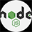

  
  
  

#  baysider-dock1

Development site for Traversy Media backend API for DevCamper

  ## Contributors: Traversy Media + Saibhreas
  
  ### Github User: https://github.com/saibhreas
  
  #### Email: fullstack@saibhreas.com
  
  ## Purpose: 

  This project is directed by TM Media, it is:

    "This is a project based course where we build an extensive, in-depth backend API for DevCamper,
     a bootcamp directory app. We will start from scratch and end up with a professional deployed 
     API with documentation."

  It's my sandbox to exhibit this model for Node Express  MongoDB side.  NPM installations will be done in pieces as the project develops.
  Annotation to the README will follow changes as prescribed by the course.
  
  ## Table of Content
  
  1. [Description](#description)
  2. [Installation](#installation)
  3. [Usage](#usage)
  4. [Contributing](#contributing)
  5. [Technologies](#technologies)
  6. [Questions](#questions)
  
  ## Description
  
  
    
  ### Licence: 
  
  ${renderLicenseLink(data.lic)}
  
  ### Installation

NPM init create package.json

  - Edit scripts in package.json

        "scripts": {
          "test": "echo \"Error: no test specified\" && exit 1",
          "start": "NODE_ENV=production node server",
         "dev": "nodemon server"
        }

Add Dependencies

    * npm i express dotenv
    * npm i -D nodemon
    * npm install mongoose
    * npm i colors
    * npm i slugify
    * npm install node-geocoder

#### Development stages
  1 Build Server

  2 Flesh out Routes to be used

     GET/POST/PUT/DELETE

      * /api/v1/bootcamps
      * /api/v1/courses
      * /api/v1/reviews
      * /api/v1/auth
      * /api/v1/users
  
    /v1 is implemented to allow for AGILE production.  /vx may be implemented later on depending on site changes and api development 

  3 Clean code for readability and scalability

    create config for dotenv
    create route folder and js
    
  4 Create controllers (middleware introduction)

  note: every piece of middleware must call next: *next()*

    Logger: example of middleware, lead into *express/morgan*

  5 express/morgan   added

  https://expressjs.com/en/resources/middleware/morgan.html

    $ npm install morgan
    var morgan = require('morgan')

  Add conditional to server so morgan is only b used in development mode add these lines to the *server.js*

    const morgan = require('morgan');
    
    if(process.env.NODE_ENV === 'development') {
      app.use(morgan('dev'));
    };
    
  6 Begin building out Postman collections and documentation

  - set new environment for project
  - set up variable for URL, makes easier for development
  - create simle CRUD for bootcamps

  7 Intro duce database to the project and begin models.
  
  - set up mongo DB
  - set up Atlas
  - install MongoDB Compass 
    - ( compass not loading correctly-- no installer,exe file.  pinned .exe file to toll bar)
  - npm installed mongoose
Documentation practices

  Files

    * controllers

        header comments for each function denote method and route and information regarding security layer / authentication T or F
        
  ### Usage

  Free to read and fork.
  
  ### Technologies
  
   Node
   Mongo
 
  ### Questions? Feel free to contact: ${data.email}
  
  ### Images
  
  
  
  ### Links
  dolphins
  
